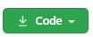
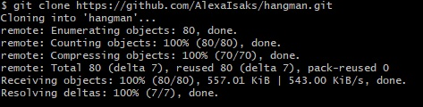
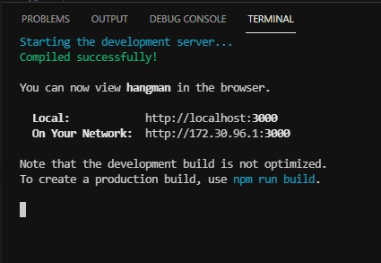
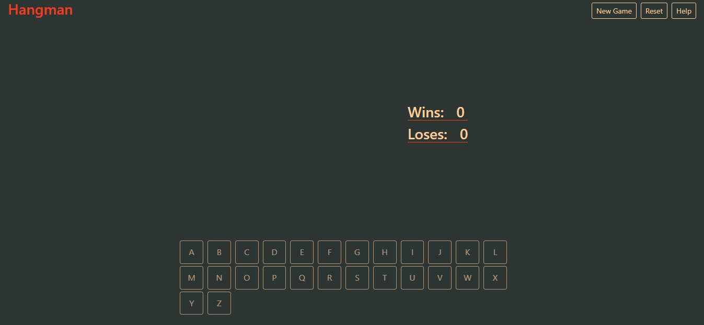
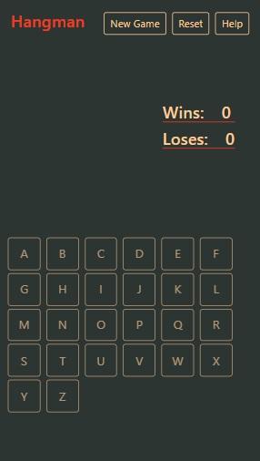
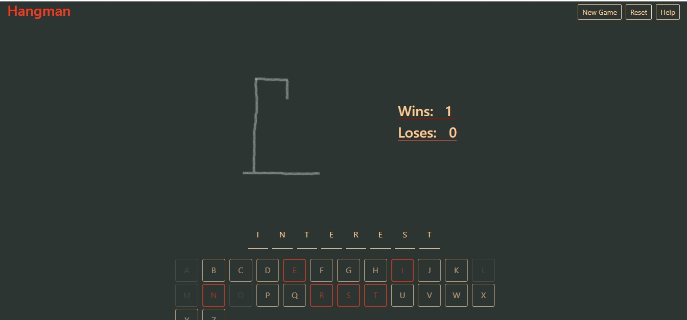

<h1 align="center">Hangman Game</h1>
The purpose of the project was to build the Hangman game using React.

## Table of Contents

* [About the Project](#about-the-project)
* [Installation](#installation)
* [Usage](#usage)
* [Game Instructions](#game-instructions)
* [Acknowledgments](#acknowledgments)

## About the Project

 

   

 

There are key elements required for this task to showcase the skills learnt in the course to date.  

* React
    - Components
    - Handling Events
    - Managing State
* Styling
    - Bootstrap 5
    - SASS

## Installation

* Select the green **Code** button  

  

* Select HTTPS and copy the URL 

   

* Open Git Bash.
* Change to the directory/folder where you want to clone the repository.
* To clone the repository, type `git clone` followed by the URL. 

  `$ git clone https://github.com/AlexaIsaks/hangman.git`

* Press **Enter**. The repository will be cloned in your folder.

   

## Usage

* Open the hangman folder in your favourite code editor.

* If you are using Visual Studio Code, open the built-in terminal and cd into the folder. Otherwise use your command prompt terminal. 

* Enter **npm install** to install all the node modules.

  

* Enter **npm start** to run the application.

  

* The hangman application should open up in your browser.

## Game Instructions

* The player needs to guess the right letters before the hangman picture is completed.
* To choose a letter, click on the keyboard.
* If the correct letter is chosen, the position of letter will be revealed.
* If an incorrect letter is chosen, part of the hangman picture will be drawn.
* To win the game, the word must be completed before the hangman picture is fully drawn.
* Player loses the game, when the hangman picture is fully drawn.
* Start New Game
  * Click the "New Game" button to start a new game.
  * Scores will be kept.
* Reset Game
  * To start a fresh game, click on the "Reset" button.
  * This will remove all the scores.

## Acknowledgments

**HyperionDev**

Certified Full Stack Web and Software Engineer 

